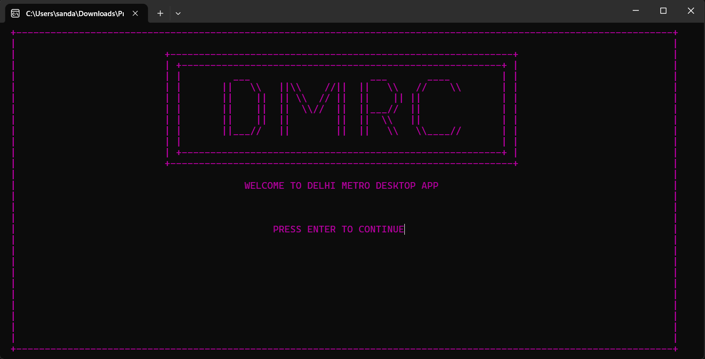
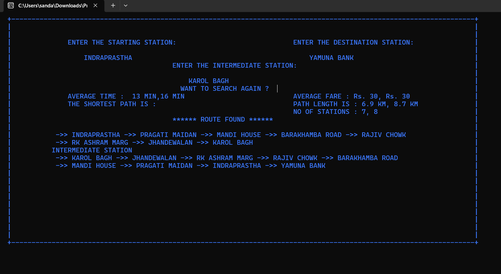

# Metro__ Route Planner  

Welcome to the **Metro__ Route Planner** repository! This project focuses on developing and optimizing route planning algorithms using C++ and Dijkstra's algorithm, specifically designed for the Delhi Metro Rail network.  

## Key Features  
- **Dijkstra's Algorithm**: Efficient computation of the shortest paths between metro stations, ensuring real-time route planning and optimization.  
- **Graph Representation**: The metro network is structured as a graph data model in C++, enabling fast traversal and pathfinding.  
- **User Interface**: A command-line interface (CLI) allows users to input their starting and destination stations to receive optimal routes and estimated travel times.  
- **Performance Optimization**: Enhancements to improve algorithm efficiency, considering the scale of the metro network and variable traffic conditions.  
- **Advanced Data Structures**: Utilization of priority queues and adjacency lists for efficient graph traversal and memory management.  

## Screenshots  
Below are some snapshots of the **Metro__ Route Planner** in action:  

  
*Caption: Command-line interface displaying the Metro__ interface.*  

  
*Caption: Example of route planning results.*  

  
*Caption: Visualization of the metro network as a graph.*  

## Technologies Used  
- C++  
- Dijkstra's Algorithm  
- Data Structures  
- Command-line Interface (CLI)  

## Contact  
For any inquiries regarding the **Metro__ Route Planner** project, feel free to reach out at **gadwalansh@gmail.com**.  
